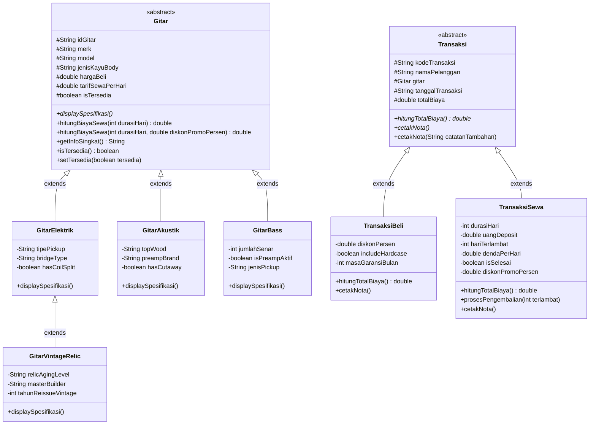

#  Pemrograman Berorientasi Objek (Java)
## Sistem Manajemen Rental & Penjualan Toko Gitar Custom Shop (CLI)

Program aplikasi berbasis konsol (*Command Line Interface* / CLI) menggunakan bahasa pemrograman **Java** yang dirancang untuk mengelola inventaris, penyewaan, penjualan, serta pengembalian instrumen gitar edisi kolektor (*Custom Shop*). Aplikasi ini mengimplementasikan konsep fundamental **Pemrograman Berorientasi Objek (PBO)** secara komprehensif, khususnya **Inheritance (2 tipe: Hierarchical & Multilevel)**, **Polymorphism (Method Overriding & Method Overloading)**, **Encapsulation**, **Abstraction**, **Condition (If-Else & Switch-Case)**, dan **Looping**.

Aplikasi dibangun menggunakan arsitektur modular dengan struktur standar **Maven Project** yang kompatibel penuh dengan **Apache NetBeans IDE**.

---

##  Identitas Mahasiswa
* **Nama** : Muhammad Fahriel
* **NIM** : 2509116050
* **Kelas / Program Studi** : B'2025 Sistem Informasi
* **Mata Kuliah** : Pemrograman Berorientasi Objek
* **Dosen Pengampu / Program** : Tugas Ujian Tengah Semester (UTS) PBO

---

##  Deskripsi Proyek & Penjelasan Studi Kasus

### 1. Ringkasan Fungsi & Kegunaan
Sistem ini menangani tata kelola operasional pada toko musik eksklusif berkonsep *Vintage & Custom Shop*. Bisnis ini berfokus pada instrumen *high-end* bernilai tinggi yang melayani musisi profesional, studio rekaman, dan kolektor melalui dua pilar layanan utama:

1. **Layanan Penjualan Unit (*Sales Transaction*)**:
   - Penjualan instrumen gitar elektrik, akustik, bass, dan edisi khusus vintage relic.
   - Perhitungan diskon member secara otomatis.
   - Pilihan paket aksesoris perlindungan ekstra (*Deluxe Flight Hardcase*).
   - Penerbitan sertifikasi garansi luthier resmi (24 bulan) dan layanan servis berkala.
   - Mengubah status ketersediaan unit menjadi terjual/non-aktif dari etalase.

2. **Layanan Penyewaan (*Rental Transaction*)**:
   - Penyewaan instrumen harian untuk konser, rekaman studio, atau kebutuhan musisi tamu.
   - Perhitungan biaya sewa berdasarkan durasi hari dan tarif spesifik unit.
   - Dukungan diskon promosi sewa khusus (*rental promo*).
   - Pengenaan uang jaminan / deposit pengaman (*refundable*) untuk menjamin keamanan instrumen bernilai tinggi.
   - Pembaruan status ketersediaan unit menjadi `[DISEWA]` sehingga tidak dapat disewa/dibeli ganda.

3. **Layanan Pengembalian Unit & Manajemen Denda (*Return & Penalty*)**:
   - Validasi nomor kontrak sewa aktif.
   - Perhitungan otomatis denda keterlambatan pengembalian (1.5x tarif sewa harian per hari keterlambatan).
   - Rekonsiliasi pemotongan denda dari uang deposit jaminan penyewa.
   - Pengembalian status instrumen kembali menjadi `[TERSEDIA]` di katalog.

4. **Pencetakan Bukti Transaksi Resmi (*Receipt & Invoice Generation*)**:
   - Pembuatan kuitansi terformat profesional dengan pemisahan rincian biaya pokok, diskon, deposit, dan catatan khusus.

---

##  Diagram Kelas & Hierarki Class

### 1. Class Diagram (Mermaid)


---

##  Implementasi Elemen Wajib PBO

### 1. Inheritance (Pewarisan) - Minimal 2 Tipe
Program ini mengimplementasikan **dua tipe pewarisan (*Inheritance*)** yang berbeda sesuai standar konsep OOP:

#### A. Tipe 1: Hierarchical Inheritance
Satu *superclass* menjadi induk dari beberapa *subclass* turunan independen:
- Superclass abstrak **`Gitar`** diturunkan secara hierarkis ke:
  1. `GitarElektrik`
  2. `GitarAkustik`
  3. `GitarBass`
- Superclass abstrak **`Transaksi`** diturunkan secara hierarkis ke:
  1. `TransaksiBeli`
  2. `TransaksiSewa`

*Cuplikan Kode:*
```java
// Hierarchical: Subclass GitarAkustik mewarisi Gitar
public class GitarAkustik extends Gitar {
    private String topWood;
    private String preampBrand;
    private boolean hasCutaway;

    public GitarAkustik(String idGitar, String merk, String model, String jenisKayuBody, 
                        double hargaBeli, double tarifSewaPerHari, 
                        String topWood, String preampBrand, boolean hasCutaway) {
        super(idGitar, merk, model, jenisKayuBody, hargaBeli, tarifSewaPerHari);
        this.topWood = topWood;
        this.preampBrand = preampBrand;
        this.hasCutaway = hasCutaway;
    }
}
```

#### B. Tipe 2: Multilevel Inheritance
Rantai pewarisan bertingkat secara vertikal dari kakek (*grandparent*) -> anak (*parent*) -> cucu (*child*):
- Level 1 (*Grandparent*): **`Gitar`** (Atribut umum instrumen: merk, model, harga, tarif)
- Level 2 (*Parent*): **`GitarElektrik`** (Mewarisi `Gitar` + atribut elektrik: tipePickup, bridgeType)
- Level 3 (*Child*): **`GitarVintageRelic`** (Mewarisi `GitarElektrik` + atribut kolektor: relicAgingLevel, masterBuilder, tahunReissueVintage)

*Cuplikan Kode:*
```java
// Multilevel: Gitar -> GitarElektrik -> GitarVintageRelic
public class GitarVintageRelic extends GitarElektrik {
    private String relicAgingLevel;
    private String masterBuilder;
    private int tahunReissueVintage;

    public GitarVintageRelic(String idGitar, String merk, String model, String jenisKayuBody, 
                             double hargaBeli, double tarifSewaPerHari, 
                             String tipePickup, String bridgeType, boolean hasCoilSplit,
                             String relicAgingLevel, String masterBuilder, int tahunReissueVintage) {
        // Memanggil konstruktor parent GitarElektrik (yang otomatis memanggil super Gitar)
        super(idGitar, merk, model, jenisKayuBody, hargaBeli, tarifSewaPerHari, tipePickup, bridgeType, hasCoilSplit);
        this.relicAgingLevel = relicAgingLevel;
        this.masterBuilder = masterBuilder;
        this.tahunReissueVintage = tahunReissueVintage;
    }
}
```

---

### 2. Polymorphism (Polimorfisme)

#### A. Dynamic Polymorphism (Method Overriding)
*Method Overriding* terjadi ketika subclass mendefinisikan ulang method yang ada pada superclass:
1. **`displaySpesifikasi()`**: Dideklarasikan abstrak pada superclass `Gitar`, kemudian masing-masing subclass (`GitarElektrik`, `GitarAkustik`, `GitarBass`, `GitarVintageRelic`) menyediakan implementasi spesifikasi fisik yang berbeda.
2. **`hitungTotalBiaya()` & `cetakNota()`**: Dideklarasikan abstrak pada `Transaksi`, dioverride oleh `TransaksiBeli` (menghitung diskon pembelian & hardcase) dan `TransaksiSewa` (menghitung tarif durasi harian, deposit, dan denda).

*Cuplikan Kode Overriding:*
```java
// Di dalam class TransaksiBeli
@Override
public double hitungTotalBiaya() {
    double hargaDasar = gitar.getHargaBeli();
    double potongan = hargaDasar * (diskonPersen / 100.0);
    double biayaTambahan = includeHardcase ? 750000 : 0;
    return (hargaDasar - potongan) + biayaTambahan;
}
```

#### B. Static Polymorphism (Method Overloading)
*Method Overloading* terjadi ketika dua atau lebih method dalam satu class memiliki nama yang sama namun memiliki parameter (jumlah atau tipe data) yang berbeda:
1. **Overloading pada class `Gitar` (`hitungBiayaSewa`)**:
   - `hitungBiayaSewa(int durasiHari)`: Perhitungan tarif standar (durasi * tarif harian).
   - `hitungBiayaSewa(int durasiHari, double diskonPromoPersen)`: Perhitungan tarif sewa dengan potongan diskon promosi.
2. **Overloading pada class `Transaksi` (`cetakNota`)**:
   - `cetakNota()`: Mencetak nota standar.
   - `cetakNota(String catatanTambahan)`: Mencetak nota dengan tambahan pesan atau catatan khusus luthier/kasir.
3. **Overloading pada class `GuitarStoreService` (`tampilkanKatalog`)**:
   - `tampilkanKatalog()`: Menampilkan seluruh instrumen (tanpa filter).
   - `tampilkanKatalog(String filterKategori)`: Menampilkan katalog yang difilter khusus berdasarkan kategori ("ELEKTRIK", "AKUSTIK", "BASS", atau "RELIC").

*Cuplikan Kode Overloading:*
```java
// Di dalam class Gitar
public double hitungBiayaSewa(int durasiHari) {
    return this.tarifSewaPerHari * durasiHari;
}

public double hitungBiayaSewa(int durasiHari, double diskonPromoPersen) {
    double totalStandar = hitungBiayaSewa(durasiHari);
    double potongan = totalStandar * (diskonPromoPersen / 100.0);
    return totalStandar - potongan;
}
```

---

### 3. Condition (Percabangan)
Penerapan struktur kontrol kondisi digunakan secara menyeluruh untuk menjamin validitas bisnis dan integritas data:
- **`switch-case`**: Digunakan untuk navigasi menu utama (pilihan 1 sampai 7) dan pemilihan filter kategori katalog.
- **`if-else`**:
  - Validasi apakah ID instrumen terdaftar dalam katalog.
  - Pengecekan status ketersediaan instrumen (`gitar.isTersedia()`). Instrumen yang berstatus `[DISEWA]` tidak dapat disewa ulang atau dibeli.
  - Perhitungan denda keterlambatan (`if (hariTerlambat > 0)`).
  - Pengecekan kalkulasi sisa deposit yang dikembalikan (`Math.max(0, uangDeposit - totalDenda)`).
  - Validasi opsi penambahan hardcase (`equalsIgnoreCase("y")`).

---

### 4. Looping (Perulangan)
- **`while (running)`**: Menjaga aplikasi CLI tetap aktif secara interaktif hingga pengguna secara eksplisit memilih menu nomor 7 (*Keluar Program*).
- **`for-each` Loop**:
  - Menampilkan iterasi tabel daftar seluruh gitar (`for (Gitar g : daftarGitar)`).
  - Iterasi penelusuran objek gitar berdasarkan ID.
  - Iterasi pencetakan seluruh riwayat transaksi yang tersimpan di sistem (`for (Transaksi t : riwayatTransaksi)`).

---

##  Alur Program & Petunjuk Eksekusi

### 1. Cara Membuka & Menjalankan di Apache NetBeans
1. Buka aplikasi **Apache NetBeans**.
2. Klik menu **File** > **Open Project...** (`Ctrl + Shift + O`).
3. Pilih folder proyek:
   ```text
   CustomShopGuitar
   ```
   *(Path: `Documents/NetBeansProjects/CustomShopGuitar`)*.
4. Klik tombol **Open Project**.
5. Tekan tombol **F6** atau klik ikon tombol panah hijau (**Run Project**) di toolbar atas NetBeans.
6. Program CLI interaktif akan langsung berjalan di panel **Output** NetBeans.

### 2. Cara Kerja Sistem (Workflow Navigasi Menu)
```text
[Menu Utama]
 │
 ├── [1] Lihat Katalog Koleksi Gitar ──> Filter kategori (Semua/Elektrik/Akustik/Bass/Relic)
 ├── [2] Cek Spesifikasi Detail     ──> Input ID Unit (e.g. EL-01/VR-01) ──> Cetak Spek Luthier
 ├── [3] Transaksi Pembelian         ──> Input Data & Diskon ──> Status unit diset terjual ──> Cetak Invoice
 ├── [4] Transaksi Penyewaan         ──> Input Durasi & Promo ──> Status unit diset [DISEWA] ──> Cetak Kontrak
 ├── [5] Pengembalian & Cek Denda    ──> Input No Kontrak & Telat ──> Kalkulasi Denda ──> Unit kembali [TERSEDIA]
 ├── [6] Lihat Riwayat Transaksi     ──> Cetak seluruh invoice penjualan & kontrak rental
 └── [7] Keluar Program              ──> Menutup sesi aplikasi
```

---

##  Tangkapan Layar (Screenshot Running Program)

Berikut adalah dokumentasi hasil eksekusi program pada antarmuka konsol Apache NetBeans:

---

### 1. Menu Utama & Katalog Koleksi Gitar


**Penjelasan Hasil Eksekusi Gambar 1:**
- **Deskripsi Tampilan**: Menampilkan banner selamat datang toko custom shop, daftar menu interaktif [1-7], serta tabel data katalog koleksi instrumen saat pengguna memilih opsi nomor `1`.
- **Alur Kerja & Input Pengguna**:
  1. Pengguna memasukkan angka `1` pada prompt menu utama.
  2. Sistem menjalankan perulangan `for-each` untuk membaca daftar objek instrumen yang tersimpan dalam `List<Gitar>`.
- **Logika PBO di Balik Layar**:
  - Mengakses atribut terenkapsulasi superclass `Gitar` (`idGitar`, `merk`, `model`, `hargaBeli`, `tarifSewaPerHari`, `isTersedia`) menggunakan method *getter*.
  - Mengimplementasikan *Polymorphism* di mana objek berbagai subclass (`GitarElektrik`, `GitarAkustik`, `GitarBass`, `GitarVintageRelic`) dapat ditampung secara seragam dalam satu koleksi tipe parent `List<Gitar>`.
  - Format output dirancang rapi menggunakan *string formatting* konsol (`printf`) dengan pemisah baris dan indikator status ketersediaan unit `[TERSEDIA]`.

---

### 2. Transaksi Penyewaan Unit Gitar (Rental Contract)


**Penjelasan Hasil Eksekusi Gambar 2:**
- **Deskripsi Tampilan**: Menampilkan form transaksi rental instrumen dan pencetakan bukti kontrak sewa resmi (*Rental Contract*) bernomor `TRX-RNT-1001`.
- **Alur Kerja & Input Pengguna**:
  1. Pengguna memilih menu `4` (*Transaksi Penyewaan / Rental Gitar*).
  2. Pengguna memasukkan nama penyewa: `Farrel`.
  3. Pengguna memilih ID instrumen yang diinginkan: `EL-01` (Fender Custom Shop '60s Stratocaster Relic).
  4. Pengguna memasukkan durasi masa pinjam: `3` Hari.
- **Logika PBO di Balik Layar**:
  - Percabangan `if (!gitar.isTersedia())` memverifikasi bahwa unit dalam kondisi siap disewa.
  - Instansiasi objek subclass `TransaksiSewa` dengan memanggil `super()` untuk menginisialisasi identitas transaksi.
  - Perhitungan komputasi biaya sewa: `Subtotal Sewa = Tarif Harian (Rp 250.000) x Durasi (3 Hari) = Rp 750.000`.
  - Pengalokasian dana jaminan deposit pengaman sebesar 2x tarif sewa harian (`Rp 500.000`).
  - Pemanggilan method mutator enkapsulasi `gitar.setTersedia(false)` untuk mengunci unit sehingga berstatus `[DISEWA]`.
  - Pemanggilan method polimorfis `@Override cetakNota()` yang menghasilkan bukti kuitansi kontrak rental.

---

### 3. Transaksi Pembelian Unit Gitar (Sales Invoice)


**Penjelasan Hasil Eksekusi Gambar 3:**
- **Deskripsi Tampilan**: Menampilkan form penjualan instrumen dan invoice pembayaran resmi (*Sales Invoice*) bernomor `TRX-BUY-1002`.
- **Alur Kerja & Input Pengguna**:
  1. Pengguna memilih menu `3` (*Transaksi Pembelian Unit Gitar*).
  2. Pengguna memasukkan data pembeli: `Farrel`.
  3. Pengguna memilih ID instrumen yang dibeli: `AK-01` (Taylor 814ce Grand Auditorium Custom).
  4. Pengguna memasukkan diskon member: `10%`.
  5. Pengguna menyetujui opsi tambahan perlindungan *Deluxe Flight Hardcase*: `y` (tambah Rp 750.000).
- **Logika PBO di Balik Layar**:
  - Instansiasi objek subclass `TransaksiBeli` yang mengaitkan objek pembeli dengan objek `GitarAkustik`.
  - Pelaksanaan komputasi harga via method polimorfis `hitungTotalBiaya()`:
    - *Harga Pokok Unit*: Rp 46.000.000
    - *Potongan Diskon Member (10%)*: -Rp 4.600.000
    - *Tambahan Deluxe Hardcase*: +Rp 750.000
    - *Total Akhir Pembayaran*: **Rp 42.150.000**
  - Unit `AK-01` diperbarui status ketersediaannya dan riwayat transaksi dicatat ke dalam memori sistem.
  - Pencetakan nota penjualan lengkap dengan klausul garansi luthier resmi 24 bulan dan servis gratis setup berkala.

---

##  Struktur Direktori Proyek

```text
CustomShopGuitar/
│
├── pom.xml                               # Konfigurasi Maven Project & Dependencies
├── README.md                             # Dokumentasi Lengkap Proyek & Laporan UTS
│
└── src/
    └── main/
        └── java/
            └── com/
                └── customshop/
                    ├── Main.java         # Driver Class (Menu CLI, Looping, Kondisi)
                    │
                    ├── model/            # Paket Domain Model Entitas PBO
                    │   ├── Gitar.java             # Superclass Abstrak (Inheritance & Overloading)
                    │   ├── GitarElektrik.java     # Subclass Hierarchical (Extends Gitar)
                    │   ├── GitarVintageRelic.java # Subclass Multilevel (Extends GitarElektrik)
                    │   ├── GitarAkustik.java      # Subclass Hierarchical (Extends Gitar)
                    │   ├── GitarBass.java         # Subclass Hierarchical (Extends Gitar)
                    │   ├── Transaksi.java         # Superclass Abstrak Transaksi
                    │   ├── TransaksiBeli.java     # Subclass Penjualan (Extends Transaksi)
                    │   └── TransaksiSewa.java     # Subclass Rental (Extends Transaksi)
                    │
                    └── service/          # Paket Layanan Bisnis
                        └── GuitarStoreService.java # Tata Kelola Katalog, Transaksi & Overloading
```

